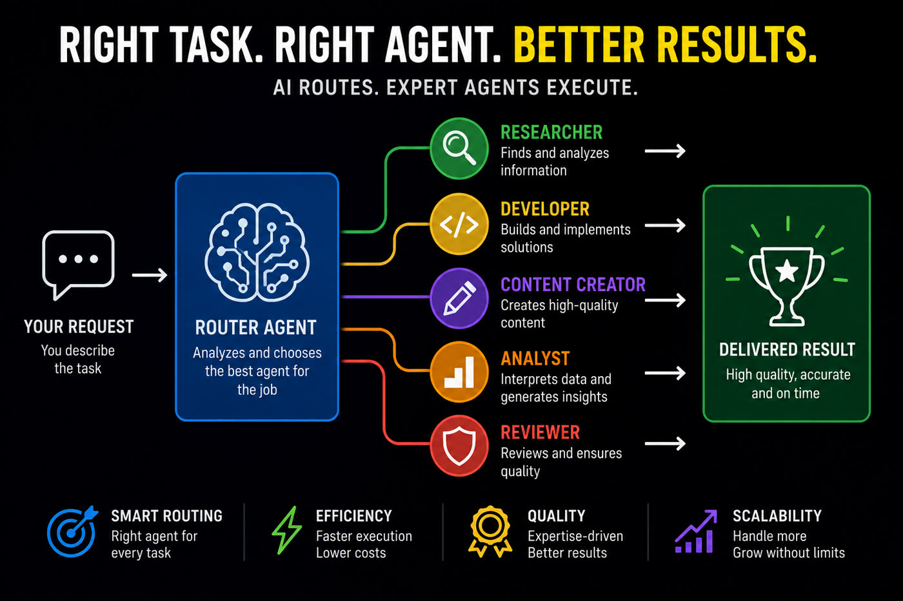
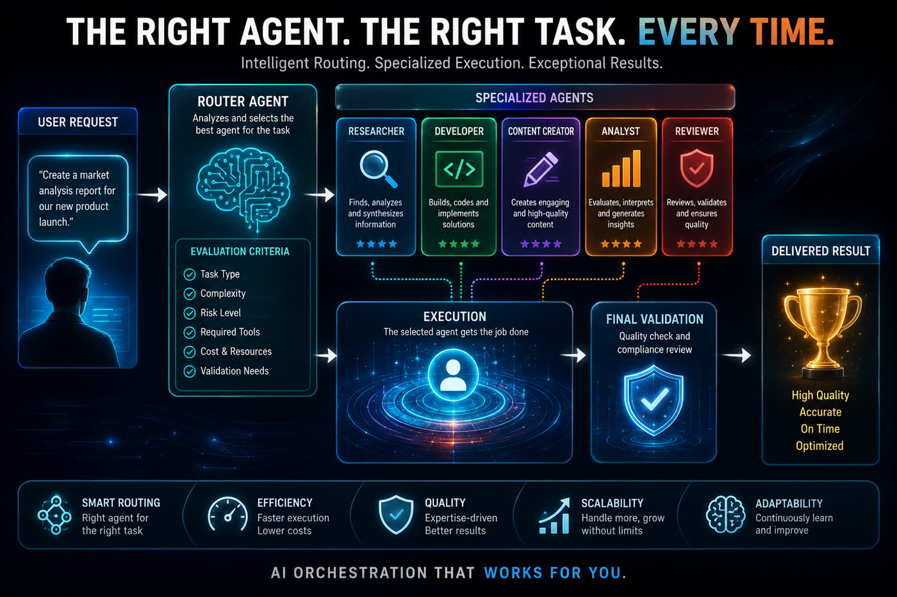

# maestro-roteador


Skill de **triagem de modelo e esforço** para Claude Code: recebe um problema bruto e decide qual modelo (haiku / sonnet / opus / fable) e qual esforço de raciocínio (low → max) usar em cada parte do trabalho, antes de despachar subagentes ou workflows.

**Guia completo (landing + passo a passo):** https://inematds.github.io/maestro-roteador/guia/
**Tira-dúvidas para iniciantes (analogias, FAQ e passo a passo):** [docs/guia-explicativo.md](docs/guia-explicativo.md)
**English version:** [README.en.md](README.en.md) · [SKILL.en.md](skills/maestro-roteador/SKILL.en.md)

---

## Por que essa skill existe

Sem regra nenhuma, agentes colapsam qualquer tarefa em "sonnet + medium" — o meio-termo genérico. Isso erra nas duas direções ao mesmo tempo:

- **Paga demais** em tarefas mecânicas (renomear 80 arquivos não precisa de sonnet, nem de medium);
- **Paga de menos** em tarefas com risco real (migração de produção precisa de mais verificação, não de "medium com cuidado") e em tarefas de gosto (copy com voz de marca precisa de repertório, que sonnet não tem).

A skill substitui o meio-termo por **duas perguntas independentes**, respondidas separadamente.

## A ideia central: dois eixos que não se convertem

| Eixo | Pergunta que ele responde | O que ele compra |
|---|---|---|
| **Modelo** | Qual nível de repertório/critério o **pior passo** da tarefa exige? | Repertório (gosto, sutileza, julgamento sem gabarito) |
| **Esforço** | Quanta deliberação e verificação a **ambiguidade + custo do erro** pagam? | Deliberação (checar o próprio trabalho, comparar caminhos) |

**Esforço compra deliberação, nunca repertório. Modelo compra repertório, nunca verificação.** É por isso que combinações "cruzadas" são legítimas e frequentes:

- `fable + low` → roteiro com voz de marca: o pior passo é **gosto** (eixo modelo), mas a decisão é direta (esforço baixo).
- `sonnet + high` → migração com produção em risco: a capacidade exigida é **padrão** (eixo modelo), mas o erro é caro — o risco pede **verificação**, não inteligência.

Quem escolhe "sonnet+medium equilibrado" está fugindo das duas perguntas, não respondendo às duas.

## O procedimento (sempre nesta ordem)

1. **Isole o pior passo.** Da tarefa inteira, qual passo mais exige critério fino?
2. **Modelo = o MENOR que resolve bem esse pior passo.**
   - Mecânico com gabarito claro (renomear, extrair, formatar) → `haiku`
   - Implementação padrão, correta-ou-errada verificável → `sonnet`
   - Julgamento sem gabarito (voz de marca, arquitetura, diagnóstico obscuro) → `opus`/`fable`
3. **Esforço = ambiguidade + custo do erro.**
   - Solução única + erro barato → `low`
   - Escolha entre caminhos OU erro chato de corrigir → `medium`
   - Vários caminhos plausíveis OU erro caro (produção, dado perdido, publicação) → `high`+
   - **Risco nomeado = high, no mínimo.** Se você mesmo escreveu "produção em risco" na justificativa, "medium com cuidado" não existe.
   - **Escada com evidência (só para erro barato):** se o erro é reversível e verificável na hora, comece no menor esforço plausível e **só suba com evidência** de resultado insuficiente — nunca "high por garantia". A escada NÃO se aplica a risco irreversível: aí a "evidência de falha" seria o próprio prejuízo.
4. **Volume:** N itens iguais → teste 1 item no menor modelo; se passa, o lote inteiro vai nele.



## Tabela rápida

| Tarefa | Modelo | Esforço | Por quê |
|---|---|---|---|
| Renomear/extrair/formatar em lote | haiku | low | Gabarito claro, erro barato |
| Feature clara, refactor localizado | sonnet | medium | Padrão, verificável |
| Migração de dados com produção em risco | sonnet | high | Capacidade padrão; o risco pede verificação, não inteligência |
| Roteiro/copy com voz de marca | fable | low | Pior passo é gosto (repertório); decisão é direta |
| Bug misterioso, decisão de arquitetura | fable | high | Difícil E ambíguo |

## Armadilhas — cada uma explicada

Racionalizações vistas em teste real, e por que estão erradas:

1. **"sonnet+medium equilibra custo e qualidade."** Meio-termo é fugir das duas perguntas. Responda cada eixo; o resultado quase nunca é o centro da matriz.
2. **"Roteiro curto não exige raciocínio pesado" → rebaixa o modelo.** Confusão de eixos: não exigir *deliberação* justifica esforço low — não justifica modelo menor quando o pior passo é critério de marca. A resposta é `fable+low`.
3. **"Medium é suficiente pra fazer com cuidado" (com produção em risco).** Você mesmo nomeou o risco. Cuidado é exatamente o que o esforço compra — risco nomeado = high.
4. **"Vou de modelo maior por garantia."** Se o pior passo está dentro da capacidade do menor, o maior entrega o mesmo cobrando mais. Garantia se compra com esforço/verificação, não com modelo.
5. **"Modelo pequeno + esforço max sai barato."** Pior combinação possível: paga deliberação pra quem não tem repertório pra usá-la, e os tokens de raciocínio acumulam.
6. **"Subo o esforço pra sair mais bonito/caprichado."** Esforço compra deliberação, não gosto. Acabamento é eixo de **modelo** (ver "empate de gosto" abaixo). Medido em teste real com 12 níveis de esforço em 2 providers: de high pra max, a diferença foi um favicon — por 2–5× os tokens.
7. **"Esforço a mais não ajuda, mas também não atrapalha."** Atrapalha — e o overthinking é o **excesso do próprio eixo esforço**, não um defeito do modelo. Esforço compra deliberação; quando sobra deliberação numa tarefa simples, o modelo re-explora caminhos já decididos e superdimensiona a solução. O resultado pode sair **pior**, não só mais caro — como quem revisa tanto a prova que troca a resposta certa pela errada. Os dois erros do eixo são simétricos: esforço de menos em tarefa ambígua erra por falta de verificação; esforço de mais em tarefa simples erra por ruído. O esforço certo é o **menor que cobre o risco**.

## Anti-overhead: a triagem também tem custo

- **Tarefa mais barata que a própria triagem não recebe triagem** — "corrige esse typo" vai direto no default do turno, sem YAML de despacho.
- **A triagem roda inline no turno principal, nunca num subagente** — despachar um agente só pra decidir modelo/esforço custa mais que a decisão vale.
- **Fragmentar também tem custo:** só despache uma parte pra subagente se o trabalho dela superar o overhead do spawn.

## Empate de gosto → a escolha é do usuário (custo × qualidade)

**Erro não é negociável; eficiência é.** Quando a escolha do modelo depende só de **acabamento** (qualidade de copy, polish visual) e não de correção, a decisão é de orçamento — e orçamento é do usuário. A triagem apresenta o par e não decide sozinha:

```yaml
opcoes:
  custo: sonnet+low        # estrutura correta, acabamento funcional
  qualidade: fable+low     # mesma estrutura, copy/polish superior
decide: usuário
```

Sinal de empate: existe um template/skill que já garantiu a estrutura (a correção vem do gabarito) e o que sobra pro modelo grande é só voz/acabamento. **Nunca** oferecer o par quando o risco é de correção — aí o modelo/esforço que garante a correção é o mínimo, não uma escolha.

## Cache: o custo escondido da troca de modelo

O prompt cache da Anthropic é **por modelo** e depende de prefixo idêntico do contexto (`tools → system → messages`). Ler do cache custa ~0,1× o preço de entrada; gravar custa 1,25× (TTL 5 min) ou 2× (TTL 1h). Perder o cache de um contexto de 100k tokens torna a próxima entrada **~12,5× mais cara**. Três regras na triagem:

1. **Troca de `/model` do turno principal só em fronteira de trabalho** (fim de fase, handoff) — nunca no meio de um bloco. Em contexto grande, a troca pode custar mais que a economia do modelo menor. Não alterne `opus → sonnet → opus` dentro do mesmo bloco.
2. **Subagente NÃO paga esse custo.** Cada Agent/Workflow tem contexto próprio: rotear uma parte pra um modelo menor via subagente não toca o cache principal. É o caminho preferido pra aplicar a matriz.
3. **Nunca keepalive artificial** ("ainda está aí?") pra segurar o cache — o Claude Code gerencia o cache sozinho e o ping custa mais do que salva. Pausa longa? Handoff enxuto e deixe expirar.

Rotina que preserva cache: blocos contínuos de trabalho, começo do contexto estável (não ligar/desligar ferramentas e MCPs no meio do bloco), tarefas relacionadas concentradas na mesma sessão.

## Harness > esforço: onde o resultado nasce

O modelo é um cérebro num pote — ferramentas, arquivos, terminal, skills e instruções (o **harness**) são os braços dele. Num teste real com a mesma tarefa em 12 níveis de esforço e 2 providers, os resultados funcionais foram quase idênticos; os níveis altos adicionaram diferenças estéticas (favicon, sombras, um donut chart) por 2–5× os tokens.

A lição: **uma spec clara em low entrega o que o esforço max tenta adivinhar.** Antes de subir o esforço, melhore o prompt, a especificação do "pronto" e as ferramentas disponíveis.



## Formato de saída (plano de despacho)

```yaml
tarefa: <resumo>
partes:
  - o_que: <subtarefa>
    pior_passo: <qual e por quê>
    modelo: haiku|sonnet|opus|fable
    esforco: low|medium|high|xhigh|max
    risco: <custo do erro em 1 linha>
turno_principal: <recomendação de /model se valer trocar — a troca é do usuário>
```

**Limite:** para subagentes/workflows a decisão é automática (parâmetros `model`/`effort` das chamadas Agent/Workflow); para o modelo da conversa principal a skill apenas recomenda — a troca é do usuário via `/model`, de preferência em fronteira de trabalho (ver Cache).

## Validação (TDD de skill)

A skill foi escrita contra um baseline medido: sem ela, agentes colapsam qualquer tarefa em "sonnet + medium". Com ela, os três cenários de teste foram para o canto certo da matriz:

| Cenário | Sem skill | Com skill |
|---|---|---|
| Renomear 80 arquivos em lote | sonnet + medium | haiku + low |
| Roteiro com voz de marca | sonnet + medium | fable + low |
| Migração de dados com produção em risco | sonnet + medium | sonnet + high |

## Estrutura

```
skills/
  maestro-roteador/
    SKILL.md       # a skill: princípio, procedimento, tabela, armadilhas, cache, saída
    SKILL.en.md    # tradução em inglês da skill
guia/
  index.html    # landing + guia de uso (GitHub Pages)
  assets/       # imagens do guia
docs/
  guia-explicativo.md  # tira-dúvidas educativo: analogias, FAQ, passo a passo
```

## Instalação

```bash
git clone https://github.com/inematds/maestro-roteador.git
ln -sfn "$(pwd)/maestro-roteador/skills/maestro-roteador" ~/.claude/skills/maestro-roteador
```

Ou copie a pasta `skills/maestro-roteador/` para `~/.claude/skills/` (skills de usuário) ou `.claude/skills/` de um projeto.

## Uso

Peça a triagem diretamente — "faz a triagem disso", "qual modelo e esforço pra isso?" — ou apenas peça o trabalho: ao despachar subagentes/workflows, o agente aplica a matriz e distribui cada parte com `model` e `effort` adequados.

## Changelog

- **v1.2.3** — versões em inglês da skill (SKILL.en.md) e do README (README.en.md).
- **v1.2.2** — armadilha do overthinking explicitada (excesso do próprio eixo esforço; o esforço certo é o menor que cobre o risco) + docs/guia-explicativo.md (tira-dúvidas educativo com analogias, FAQ e passo a passo).
- **v1.2.1** — escada com evidência (erro barato começa em low e sobe só com evidência), 2 armadilhas novas (estética não é esforço; overthinking piora), seção de cache (troca só em fronteira, subagente grátis em cache, sem keepalive); guia ganha hero com imagem + seções Cache e Harness; README educativo completo.
- **v1.1.1** — guia/index.html (landing+guia padrão INEMA) + regra anti-overhead na skill.
- **v1.1.0** — empate de gosto oferece escolha custo (sonnet+low) × qualidade (fable+low).
- **v1.0.0** — skill maestro-roteador: triagem de modelo e esforço (matriz de dois eixos).

## Licença

MIT — projeto de pesquisa/educação INEMA.
